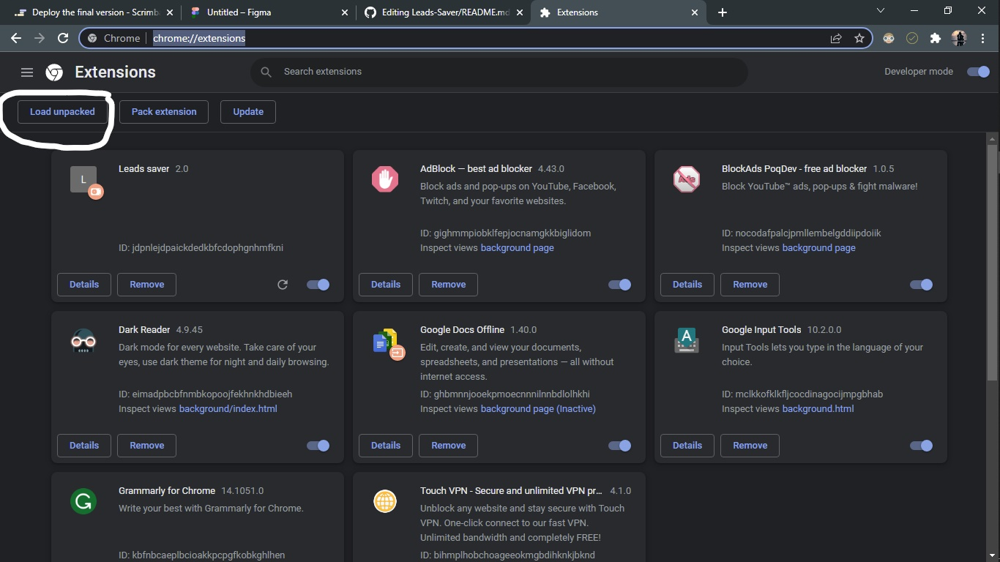

# Leads-Saver
This is an chrome extension which can be used as an link saver. This extension uses Chrome API and stores all of the data in chrome.

To use this extension you can follow the following steps:
<ol><li>Download zip folder and extract.</li>
  <li>Open your chrome and type chrome://extensions/</li>
  
  <li>Click on Load Unpacked and choose the extracted folder.</li>
  <li>Now your extension is ready to use you can pin it on extension bar</li>
